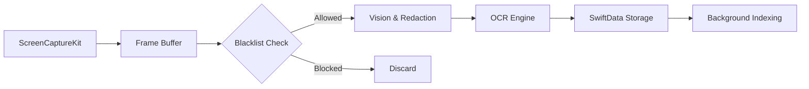

# 👁️ WatchYourDay: The Silent Observer
**Enterprise-Grade Automated Activity Tracking & Intelligence System**

> *Veritas in Data. Privacy by Design.*

---

## 📖 Table of Contents
1. [Executive Summary](#1-executive-summary)
2. [Core Philosophy](#2-core-philosophy)
3. [Feature Suite](#3-feature-suite)
4. [User Manual](#4-user-manual)
5. [Privacy Manifesto](#5-privacy-manifesto)
6. [Technical Architecture](#6-technical-architecture)

---

## 1. Executive Summary
**WatchYourDay** is not just a time tracker; it is an intelligent, autonomous system designed to capture the "Truth of Work" without user intervention. By leveraging native macOS frameworks like `ScreenCaptureKit`, `Vision`, and `CoreML` (via Ollama), it constructs a pixel-perfect history of your digital life while respecting the sanctity of your privacy.

Built with **Swift 6** and **SwiftData**, it represents the state-of-the-art in modern macOS development, featuring a stealth-mode agent architecture that runs silently in the background.

## 2. Core Philosophy
1.  **Invisibility:** The observer effect should be zero. The app runs without a Dock icon, living quietly in the Menu Bar.
2.  **Intelligence:** Raw data is useless. We transform pixels into text (OCR), text into context (Categorization), and context into insight (AI Summaries).
3.  **Sovereignty:** Your data never leaves your device. All processing—OCR, Redaction, AI Analysis—happens on `localhost`.

## 3. Feature Suite

### 🕵️ Stealth Agent (New)
Operates as a strictly `LSUIElement` background process.
- **No Dock Icon:** Does not clutter your workspace.
- **Menu Bar Control:** Minimal footprint execution.
- **Auto-Start:** Integrates with `SMAppService` for reliable launch-at-login.

### 🛡️ Privacy Shield
- **Blacklist Manager:** Kernel-level exclusion of sensitive apps (Banking, Password Managers) before frame processing.
- **On-Device Redaction:** Automatically detects and blurs sensitive text (PII) using Apple's Vision framework.

### 🧠 Intelligent Search
- **OCR Engine:** Indexes all text on your screen in real-time.
- **Universal Query:** Search for "Invoice #1234" or "Function XYZ" and instantly jump to that moment in time.

### 🤖 AI Analyst
- **Ollama Integration:** Connects to local LLMs (Llama3, Mistral) to generate human-readable daily reports.
- **Insight Engine:** "You spent 4 hours in Xcode but switched context 15 times."

## 4. User Manual

### Getting Started
1.  **Launch:** The app starts silently. Look for the "Eye" icon in the menu bar.
2.  **Dashboard:** Click the menu bar icon -> "Open Dashboard" (or Press `Cmd+O` if configured).
3.  **Permissions:** Grant Screen Recording access when prompted.

### Using the Dashboard
- **Timeline:** Scroll through your day visually.
- **Stats:** View focus breakdown and request AI Analysis.
- **Search:** Use the Magnifying Glass to find historical content.
- **Settings:** Configure Blacklist and Data Retention policies (Default: 30 Days).

## 5. Privacy Manifesto
We believe privacy is a fundamental human right.
- **Local First:** No data is sent to cloud servers. Check our network traffic; you will only see `localhost`.
- **Encryption:** (Roadmap) Database encryption at rest.
- **Transparency:** Open source code allows full auditability.

## 6. Technical Architecture

### The Pipeline

### Tech Stack
- **Language:** Swift 6.0
- **UI:** SwiftUI + AppKit (Hybrid)
- **Data:** SwiftData (Persistent CloudKit-ready Schema)
- **Concurrency:** Swift Actors (`ScreenCaptureService`, `AIService`)
- **AI:** Ollama API Bridge

---

*Generated by Antigravity for Dogan*
*Version 2.0.0 (Enterprise Gold)*
